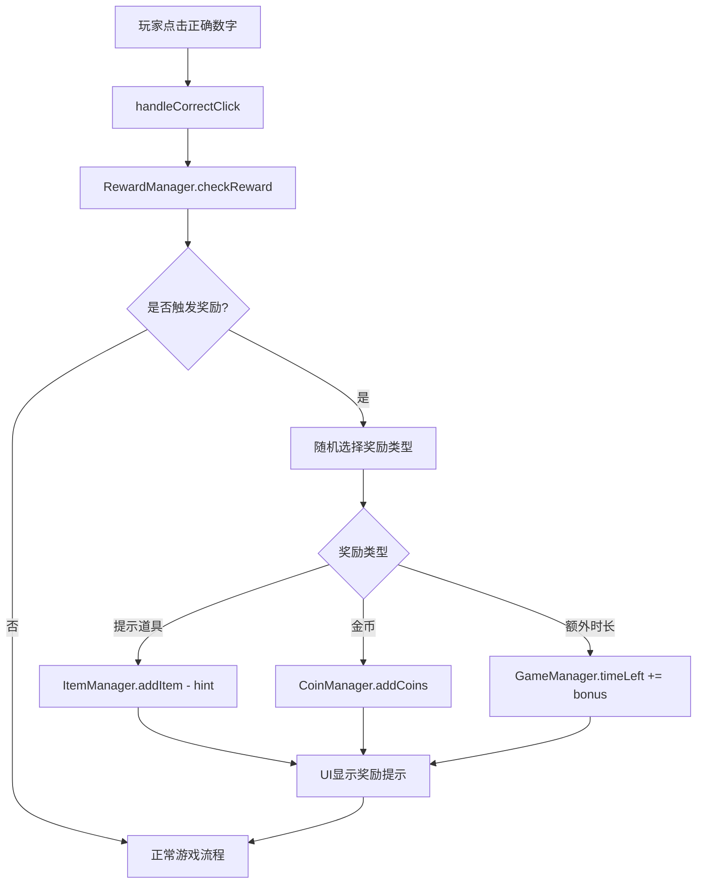

# 奖励系统设计方案

## 概述

在点击图形数字时，概率性增加奖励（提示道具、金币、额外时长），并设计一个新道具"幸运之星"来提高获得奖励的概率。

## 系统架构



## 奖励类型设计

| 奖励类型 | 图标 | 基础概率 | 奖励数值 |
|---------|------|---------|---------|
| 提示道具 | 💡 | 0% | +1个提示道具 |
| 金币 | 🪙 | 0% | +5~15金币 |
| 额外时长 | ⏰ | 0% | +3秒 |

> **注意**：基础概率为0，只有解锁幸运之星技能后才能触发奖励

## 幸运之星道具设计

### 道具属性

| 属性 | 值 |
|-----|-----|
| ID | lucky_star |
| 名称 | 幸运之星 |
| 图标 | ⭐ |
| 描述 | 提高点击数字时获得奖励的概率 |
| 价格 | 500金币 |
| 最大等级 | 3级 |

### 幸运之星效果

| 等级 | 概率加成 | 升级价格 |
|-----|---------|---------|
| 1级 | +5%概率 | 500金币 |
| 2级 | +10%概率 | 1000金币 |
| 3级 | +20%概率 | 2000金币 |

### 概率计算公式

```javascript
// 基础概率（均为0，需要幸运之星才能触发）
const baseProbability = {
  hint: 0,    // 0%
  coin: 0,    // 0%
  time: 0     // 0%
};

// 幸运之星加成
const luckyStarBonus = {
  0: 0,      // 未解锁 - 无法触发奖励
  1: 0.05,   // +5%
  2: 0.10,   // +10%
  3: 0.20    // +20%
};

// 最终概率 = 基础概率 + 幸运之星加成
const finalProbability = baseProbability + luckyStarBonus[level];
```

## 文件修改清单

### 1. 新建文件

#### `js/rewardManager.js`

```javascript
export default class RewardManager {
  constructor() {
    // 奖励配置
    this.rewards = new Map();
    this.initRewards();
    // 幸运之星等级
    this.luckyStarLevel = 0;
    // 奖励回调
    this.onRewardTriggered = null;
  }

  initRewards() {
    this.rewards.set('hint', {
      id: 'hint',
      name: '提示道具',
      icon: '💡',
      baseProbability: 0.03,
      action: (managers) => {
        managers.itemManager.addItem('hint', 1);
        return { type: 'hint', amount: 1 };
      }
    });

    this.rewards.set('coin', {
      id: 'coin',
      name: '金币',
      icon: '🪙',
      baseProbability: 0.05,
      action: (managers) => {
        const amount = Math.floor(Math.random() * 11) + 5; // 5-15金币
        managers.coinManager.addCoins(amount);
        return { type: 'coin', amount };
      }
    });

    this.rewards.set('time', {
      id: 'time',
      name: '额外时长',
      icon: '⏰',
      baseProbability: 0.04,
      action: (managers) => {
        const bonus = 3;
        managers.gameManager.addTime(bonus);
        return { type: 'time', amount: bonus };
      }
    });
  }

  // 检查是否触发奖励
  checkReward(managers) {
    const luckyBonus = this.getLuckyStarBonus();
    
    for (const [id, reward] of this.rewards) {
      const finalProbability = reward.baseProbability * (1 + luckyBonus);
      
      if (Math.random() < finalProbability) {
        const result = reward.action(managers);
        if (this.onRewardTriggered) {
          this.onRewardTriggered(reward, result.amount);
        }
        return result;
      }
    }
    
    return null;
  }

  getLuckyStarBonus() {
    const bonuses = [0, 0.05, 0.10, 0.20];
    return bonuses[this.luckyStarLevel] || 0;
  }

  // 升级幸运之星
  upgradeLuckyStar() {
    if (this.luckyStarLevel < 3) {
      this.luckyStarLevel++;
      this.saveProgress();
      return true;
    }
    return false;
  }

  // 保存和加载
  saveProgress() { ... }
  loadProgress() { ... }
}
```

### 2. 修改文件

#### `js/gameManager.js`

在 `handleCorrectClick` 方法中添加奖励检查：

```javascript
handleCorrectClick(polygon) {
  // ... 现有代码 ...
  
  // 检查奖励
  if (this.rewardManager && this.gameMode === 'timed') {
    this.rewardManager.checkReward({
      itemManager: this.itemManager,
      coinManager: this.coinManager,
      gameManager: this
    });
  }
  
  // ... 现有代码 ...
}

// 添加时间增加方法
addTime(seconds) {
  this.timeLeft += seconds;
}
```

#### `js/skillManager.js`

添加幸运之星技能：

```javascript
this.skills.set('lucky_star_1', {
  id: 'lucky_star_1',
  name: '幸运之星 I',
  category: 'luck',
  description: '奖励触发概率+5%',
  effect: { type: 'lucky_bonus', value: 0.05 },
  maxLevel: 1,
  currentLevel: 0,
  cost: 500,
  prerequisite: null,
  icon: '⭐'
});

this.skills.set('lucky_star_2', {
  id: 'lucky_star_2',
  name: '幸运之星 II',
  category: 'luck',
  description: '奖励触发概率+10%',
  effect: { type: 'lucky_bonus', value: 0.10 },
  maxLevel: 1,
  currentLevel: 0,
  cost: 1000,
  prerequisite: 'lucky_star_1',
  icon: '⭐'
});

this.skills.set('lucky_star_3', {
  id: 'lucky_star_3',
  name: '幸运之星 III',
  category: 'luck',
  description: '奖励触发概率+20%',
  effect: { type: 'lucky_bonus', value: 0.20 },
  maxLevel: 1,
  currentLevel: 0,
  cost: 2000,
  prerequisite: 'lucky_star_2',
  icon: '⭐'
});
```

#### `js/ui.js`

添加奖励提示显示：

```javascript
// 奖励通知数据
this.rewardNotifications = [];

// 显示奖励通知
showRewardNotification(reward, amount) {
  this.rewardNotifications.push({
    icon: reward.icon,
    text: `${reward.name} +${amount}`,
    life: 2.0,  // 2秒显示时间
    y: 0,
    alpha: 1
  });
}

// 在渲染循环中更新和绘制奖励通知
updateRewardNotifications(deltaTime) {
  for (let i = this.rewardNotifications.length - 1; i >= 0; i--) {
    const notification = this.rewardNotifications[i];
    notification.life -= deltaTime;
    notification.y -= deltaTime * 30; // 向上飘动
    notification.alpha = Math.min(1, notification.life);
    
    if (notification.life <= 0) {
      this.rewardNotifications.splice(i, 1);
    }
  }
}

drawRewardNotifications(ctx) {
  for (const notification of this.rewardNotifications) {
    ctx.save();
    ctx.globalAlpha = notification.alpha;
    ctx.font = 'bold 24px Arial';
    ctx.fillStyle = '#FFD700';
    ctx.textAlign = 'center';
    ctx.fillText(
      `${notification.icon} ${notification.text}`,
      this.width / 2,
      this.height / 3 + notification.y
    );
    ctx.restore();
  }
}
```

#### `js/findGameMain.js`

初始化 RewardManager 并设置回调：

```javascript
import RewardManager from './rewardManager';

constructor() {
  // ... 现有代码 ...
  this.rewardManager = new RewardManager();
  
  // 设置奖励回调
  this.rewardManager.onRewardTriggered = (reward, amount) => {
    this.ui.showRewardNotification(reward, amount);
    this.soundManager.playReward && this.soundManager.playReward();
  };
  
  // 将 rewardManager 传递给 gameManager
  this.gameManager.setRewardManager(this.rewardManager);
}
```

## UI 效果设计

### 奖励触发效果

1. **飘动文字**：在屏幕中央显示奖励图标和数量，向上飘动并渐隐
2. **粒子效果**：金币奖励时显示金色粒子
3. **音效**：播放奖励获得音效

### 幸运之星技能界面

在技能页面添加新的"幸运"分类，显示幸运之星技能树：

```
⭐ 幸运之星 I(500金币) → ⭐ 幸运之星 II(1000金币) → ⭐ 幸运之星 III(2000金币)
     +5%概率                 +10%概率                +20%概率
```

## 实现步骤

1. **创建 RewardManager 类**
   - 定义奖励类型和概率
   - 实现奖励触发逻辑
   - 实现幸运之星等级管理

2. **修改 SkillManager**
   - 添加幸运之星技能（3级）
   - 实现 getLuckyBonus 方法

3. **修改 GameManager**
   - 在 handleCorrectClick 中调用奖励检查
   - 添加 addTime 方法

4. **修改 UI**
   - 添加奖励通知显示
   - 添加飘动文字效果

5. **修改 FindGameMain**
   - 初始化 RewardManager
   - 设置奖励回调

6. **测试验证**
   - 测试各种奖励触发
   - 测试幸运之星效果
   - 测试UI显示效果

## 注意事项

1. 奖励概率应该适中，避免过于频繁影响游戏平衡
2. 幸运之星作为永久升级，价格应相对较高
3. 奖励通知不应该遮挡重要游戏信息
4. 需要考虑存档兼容性
